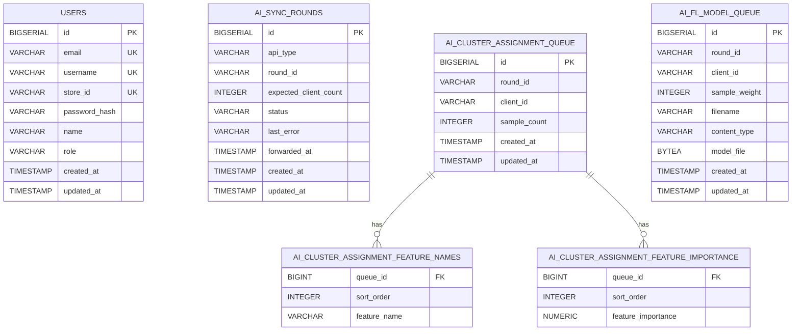

# Fedstock Backend Current Data Structure

Last checked: 2026-06-13

## 1. Readable Overview

### Persistent Data

| 테이블 | JPA Entity | 목적 |
|---|---|---|
| `users` | `UserEntity` | JWT 사용자, 클라이언트 식별자, 권한 |
| `ai_sync_rounds` | `AiSyncRoundEntity` | `all_clients` 라운드별 수집/전송 상태 |
| `ai_cluster_assignment_queue` | `AiClusterAssignmentQueueEntity` | 클러스터링 `all_clients` 요청 큐 |
| `ai_cluster_assignment_feature_names` | Element collection | 클러스터링 feature 이름 배열 |
| `ai_cluster_assignment_feature_importance` | Element collection | 클러스터링 feature importance 배열 |
| `ai_fl_model_queue` | `AiFlModelQueueEntity` | FL 모델 `all_clients` multipart 파일 큐 |

### API Request Data Structures

| 구조 | 위치 | 저장 여부 | 설명 |
|---|---|---:|---|
| `RegisterRequest` | `auth/api/dto` | `users` 저장 | 회원가입 요청 |
| `LoginRequest` | `auth/api/dto` | 저장 안 함 | 로그인 요청 |
| `ClusterAssignmentRequest` | `ai/api/dto` | `all_clients`만 큐 저장 | feature importance 기반 클러스터 배정 요청 |
| `ClusterAssignmentBatchRequest` | `ai/api/dto` | 저장 안 함 | 모든 클라이언트가 도착했을 때 AI로 보내는 batch JSON |
| FL model multipart fields | `AiClientSyncController` | `all_clients`만 큐 저장 | `.pt` 모델 업로드 후 AI 레포로 전달 |

`single_client`는 저장하지 않고 즉시 AI로 전달한다. `all_clients`는 `users` 전체 수만큼 같은 `round_id`에 요청이 모이면 Spring이 AI batch API를 한 번 호출한다.

### Mermaid

### `users`

| 컬럼 | Java field | 타입 | 제약 | 설명 |
|---|---|---|---|---|
| `id` | `id` | `BIGSERIAL` / `Long` | PK | 사용자 ID |
| `email` | `email` | `VARCHAR(255)` / `String` | NOT NULL, UNIQUE | 로그인 이메일 |
| `username` | `username` | `VARCHAR(255)` / `String` | NOT NULL, UNIQUE | 로그인 사용자명 |
| `store_id` | `storeId` | `VARCHAR(100)` / `String` | NOT NULL, UNIQUE | 클라이언트 ID |
| `password_hash` | `passwordHash` | `VARCHAR(255)` / `String` | NOT NULL | BCrypt 비밀번호 해시 |
| `name` | `name` | `VARCHAR(100)` / `String` | NOT NULL | 사용자 이름 또는 매장명 |
| `role` | `role` | `VARCHAR(30)` / `String` | NOT NULL, CHECK | `USER`, `ADMIN` |
| `created_at` | `createdAt` | `TIMESTAMP` / `LocalDateTime` | NOT NULL | 생성 시각 |
| `updated_at` | `updatedAt` | `TIMESTAMP` / `LocalDateTime` | NOT NULL | 수정 시각 |

### `ai_sync_rounds`

| 컬럼 | Java field | 타입 | 제약 | 설명 |
|---|---|---|---|---|
| `id` | `id` | `BIGSERIAL` / `Long` | PK | 라운드 상태 ID |
| `api_type` | `apiType` | `VARCHAR(50)` / enum | NOT NULL | `CLUSTER_ASSIGNMENT`, `FL_MODEL` |
| `round_id` | `roundId` | `VARCHAR(120)` / `String` | NOT NULL | 클라이언트가 보낸 라운드 ID |
| `expected_client_count` | `expectedClientCount` | `INTEGER` / `Integer` | NOT NULL | 라운드 시작 시점의 전체 유저 수 |
| `status` | `status` | `VARCHAR(30)` / enum | NOT NULL | `COLLECTING`, `FORWARDING`, `FORWARDED`, `FAILED` |
| `last_error` | `lastError` | `VARCHAR(500)` / `String` | NULL | AI 전송 실패 사유 |
| `forwarded_at` | `forwardedAt` | `TIMESTAMP` / `LocalDateTime` | NULL | AI 전송 완료 시각 |
| `created_at` | `createdAt` | `TIMESTAMP` / `LocalDateTime` | NOT NULL | 생성 시각 |
| `updated_at` | `updatedAt` | `TIMESTAMP` / `LocalDateTime` | NOT NULL | 수정 시각 |

### `ai_cluster_assignment_queue`

| 컬럼 | Java field | 타입 | 제약 | 설명 |
|---|---|---|---|---|
| `id` | `id` | `BIGSERIAL` / `Long` | PK | 큐 ID |
| `round_id` | `roundId` | `VARCHAR(120)` / `String` | UNIQUE pair | 라운드 ID |
| `client_id` | `clientId` | `VARCHAR(100)` / `String` | UNIQUE pair | `users.store_id`와 매칭 |
| `sample_count` | `sampleCount` | `INTEGER` / `Integer` | NOT NULL | 클라이언트 샘플 수 |

### `ai_fl_model_queue`

| 컬럼 | Java field | 타입 | 제약 | 설명 |
|---|---|---|---|---|
| `id` | `id` | `BIGSERIAL` / `Long` | PK | 큐 ID |
| `round_id` | `roundId` | `VARCHAR(120)` / `String` | UNIQUE pair | 라운드 ID |
| `client_id` | `clientId` | `VARCHAR(100)` / `String` | UNIQUE pair | `users.store_id`와 매칭 |
| `sample_weight` | `sampleWeight` | `INTEGER` / `Integer` | NULL | FL aggregation weight |
| `filename` | `filename` | `VARCHAR(255)` / `String` | NOT NULL | 원본 `.pt` 파일명 |
| `content_type` | `contentType` | `VARCHAR(120)` / `String` | NULL | multipart content type |
| `model_file` | `modelFile` | `BYTEA` / `byte[]` | NOT NULL | 업로드된 `.pt` 파일 |

## 2. SQL

See `/Users/kento/Desktop/Project/fedstock/Fedstock-Backend/db/init/001_mvp_schema.sql`.
